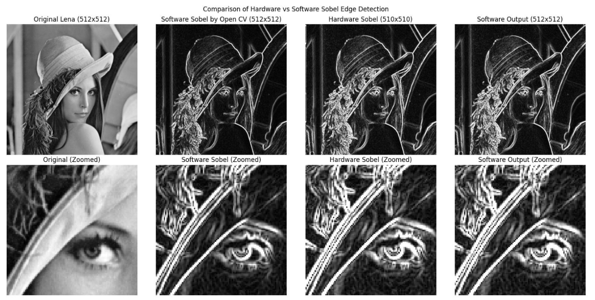
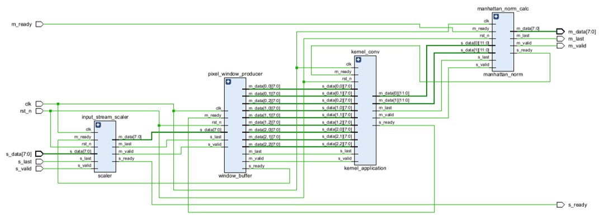

# Sobel Edge Detector Acceleration on Xilinx Zynq-7000 SoC

## Overview
This project presents the **design, implementation, and evaluation** of a complete **System-on-Chip (SoC)** solution for accelerating the **Sobel edge detection algorithm** on the **Xilinx Zynq-7000 AP SoC** platform.  
The main objective is to leverage the combined architecture of the **Processing System (PS)** and **Programmable Logic (PL)** of the Zynq device to achieve a significant performance improvement compared to a pure software implementation.

In the follwing sections, we detail the system architecture, implementation steps, and performance evaluation of both the software and hardware-accelerated versions of the Sobel edge detection algorithm. In the next image, we can see the Sobel Edge Detection process applied to a sample image.

---

## System Description

### 1. Software Implementation
The Sobel edge detection algorithm was first implemented in **C** and executed on the **ARM Cortex-A9 cores** of the Zynq Processing System under a **PetaLinux** environment.  
This software version provided baseline **performance metrics**—such as execution time and throughput—used later for comparison with the hardware-accelerated implementation.

---

### 2. Hardware Acceleration (VHDL Implementation)
A dedicated **Sobel Edge Detector IP Core** was designed in **VHDL** to accelerate the computation within the **Programmable Logic (PL)**.  

**Key features:**
- **AXI4-Lite interface** for control and performance counter access  
- **AXI4-Stream interfaces** for image data input/output  
- **Full AXI DMA compatibility**  
- **Pipeline and parallel processing techniques** enabling processing rates up to **200 MSamples/sec** at **200 MHz**

After simulation and verification using a **VHDL testbench**, the IP Core was integrated into a complete SoC design.

---

### 3. System Integration
The full SoC connects the **Sobel IP Core** with an **AXI DMA** module, which manages data transfers between the **DDR3 DRAM** and the programmable logic.  
A **C-based user application** running under **PetaLinux** controls the hardware accelerator, manages DMA transfers, and collects performance data for direct comparison with the software-only implementation.

#### Sobel Processor Architecture
The main Sobel accelerator (sobel_processing_core.vhd) is composed of multiple hardware modules working together to implement the complete Sobel edge detection pipeline. The architecture is fully pipelined and optimized for efficient FPGA resource usage.

##### Main Modules
- **Input Stream Scaler** (`scaler.vhd`)
  - Prepares incoming pixel data for processing by optionally scaling pixel values to reduce overflow.
  - In the current implementation, scaling is bypassed to maintain identical output with the software version.
- **Pixel Window Producer** (`window_buffer.vhd`)
  - Implements a sliding buffer that continuously generates 3×3 pixel windows required for convolution.
  - Uses internal line buffers and counters to stream neighboring pixels without additional memory access latency.
- **Kernel Convolution Unit** (`kernel_application.vhd`)
  - Applies the Sobel kernels (Gx and Gy) on each 3×3 window to compute horizontal and vertical gradients.
  - Uses a 3-stage internal pipeline to improve timing performance and avoid implementation timing violations.
- **Manhattan Norm Calculator** (`manhattan_norm.vhd`)
  - Computes the gradient magnitude using the Manhattan norm (|Gx| + |Gy|) instead of the Euclidean norm.
  - Avoids expensive square root operations while preserving edge quality, with output clamped to the valid grayscale range 0–255.

##### Architecture Characteristics

The design exploits pixel-level parallelism and pipeline processing, allowing continuous streaming and high-throughput image filtering. This hardware organization enables fast and efficient Sobel edge detection, making the accelerator suitable for real-time embedded vision applications on the Zynq-7000 SoC platform.

---

## Evaluation and Results
After functional verification using dedicated testbenches, the complete Sobel SoC architecture was synthesized and implemented in Xilinx Vivado targeting the ZedBoard (Zynq-7000) platform. The implementation flow generated the hardware bitstream, which was later integrated into the PetaLinux build and deployed through an SD card to configure the Programmable Logic (PL).

The design was evaluated under both software-only and hardware-accelerated execution modes using grayscale images of resolution 512×512.

### FPGA Implementation Summary
Implementation reports show that the design has a very small hardware footprint, leaving significant headroom for future extensions:

| Resource | Utilization | Available | Usage |
| --- | --- | --- | --- |
| LUT | 3576 | 53200 | 6.72% |
| LUTRAM | 678 | 17400 | 3.90% |
| FF | 5183 | 106400 | 4.87% |
| BRAM | 6 | 140 | 4.29% |

The low utilization confirms that the Sobel accelerator is lightweight and efficiently mapped to the FPGA fabric. Block RAMs are primarily used by FIFO structures generated through the Xilinx IP Catalog, while LUTs and Flip-Flops implement the filtering logic, control paths, and AXI interfacing.

### Timing Analysis
Timing closure was successfully achieved, with all user-defined constraints met for target frequencies of 100 MHz and 200 MHz.

Key timing metrics:

- Worst Negative Slack (WNS): 0.298 ns
- Worst Hold Slack (WHS): 0.036 ns
- Worst Pulse Width Slack (WPWS): 1.520 ns
- Failing Endpoints: 0

No timing violations were reported, indicating correct synchronization across clock domains and stable operation. Although the WNS margin for the 5 ns clock period is relatively tight, the design still satisfies all constraints.

### Power Consumption
The estimated on-chip power consumption is:

- Total On-Chip Power: 1.717 W
- Dynamic Power: 1.574 W (92%)
- Static Power: 0.143 W (8%)

Most dynamic power is attributed to the Processing System (PS7), which accounts for approximately 96% of dynamic power consumption, while the custom accelerator logic contributes only a very small fraction.

This demonstrates that the hardware accelerator introduces minimal additional power overhead while substantially improving computational performance.

### Performance Comparison
Both implementations were compared using:

- Execution time
- Throughput
- FPGA resource utilization
- Power efficiency

The hardware-accelerated implementation achieved a significant speedup compared to the software-only version, validating the effectiveness of FPGA-based acceleration for real-time image processing.

These results highlight the benefits of hardware/software co-design for embedded vision systems, combining the flexibility of software execution on ARM cores with the parallel processing capabilities of FPGA logic.

---

## Tools & Technologies
- **Platform:** Xilinx Zynq-7000 AP SoC  
- **Languages:** C, VHDL  
- **Environment:** PetaLinux, Vivado Design Suite  
- **Interfaces:** AXI4-Lite, AXI4-Stream, AXI DMA  

---

## Repository Structure 

- **[sobel_software/](./sobel_software)**: Contains the C implementation of the Sobel algorithm with timing utilities.
- **[sobel_ip_core/](./sobel_ip_core)**: Contains the VHDL implementation of the Sobel IP Core and related files, including testbenches and simulation scripts.
- **[sobel_pl/](./sobel_pl)**: Contains the Vivado project files and C-based user application for the complete SoC design integrating the Sobel IP Core.
- **[scripts/](./scripts)**: Contains setup scripts for the development environment.
- **[python-viewer/](./python-viewer)**: Contains a Python-based image viewer for visualizing and analyzing Sobel edge detection results.
- **[data/](./data)**: Contains sample images and outputs of both the software and hardware implementations for testing and analysis.
- **[doc/](./doc)**: Contains the project description and report files.
